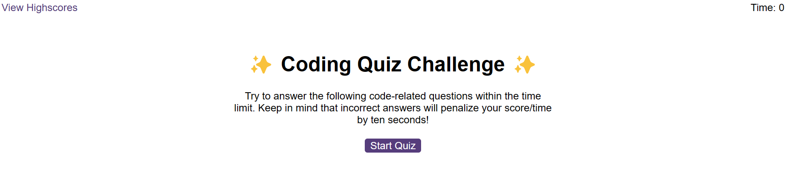

# Code-Quiz 📚

Direct Link to Application: [Code Quiz](https://msalarzon.github.io/Code-Quiz/)

## Description

Dive into this super beginner-friendly 'Code-Quiz' – a straightforward and basic introduction to web development concepts. Created for beginners, this quiz is designed to share the joy of learning. Click 'Start' to explore a few simple questions about the fundamentals of web development. 
## Table of Contents

- [Installation](#installation)
- [Usage](#usage)
- [Resources](#resources)
- [License](#license)

## Installation

To run this project locally, follow these steps:

1. Clone the GitHub repository to your local machine.
2. Navigate to the project directory.
3. Open the `index.html` file in your preferred web browser.

## Usage

This quiz is a humble attempt to share basic web development concepts. Explore, learn, and have fun with your first steps in the world of coding!

- Receive immediate feedback on your answers.
After completing the quiz, view your score and, if desired, save your initials and score.
Exploring the Code:

- Check out the JavaScript, HTML, and CSS files in the assets folder to see how the quiz functionality is implemented.
Feel free to customize and expand the quiz to enhance your learning experience.

## Resources

I would like to acknowledge the following resources that were instrumental in completing this project:

- [MDN Web Docs](https://developer.mozilla.org/): An invaluable resource for JavaScript documentation and examples.
- [Stack Overflow](https://stackoverflow.com/): A helpful community for problem-solving and debugging.
- [W3Schools](https://www.w3schools.com/): A comprehensive source for learning and practicing web development concepts.
- [GitHub](https://github.com/): For version control and project hosting.
- [Codecademy](https://www.codecademy.com/): For providing interactive learning experiences.

## License

This project is licensed under the [MIT License](LICENSE).
